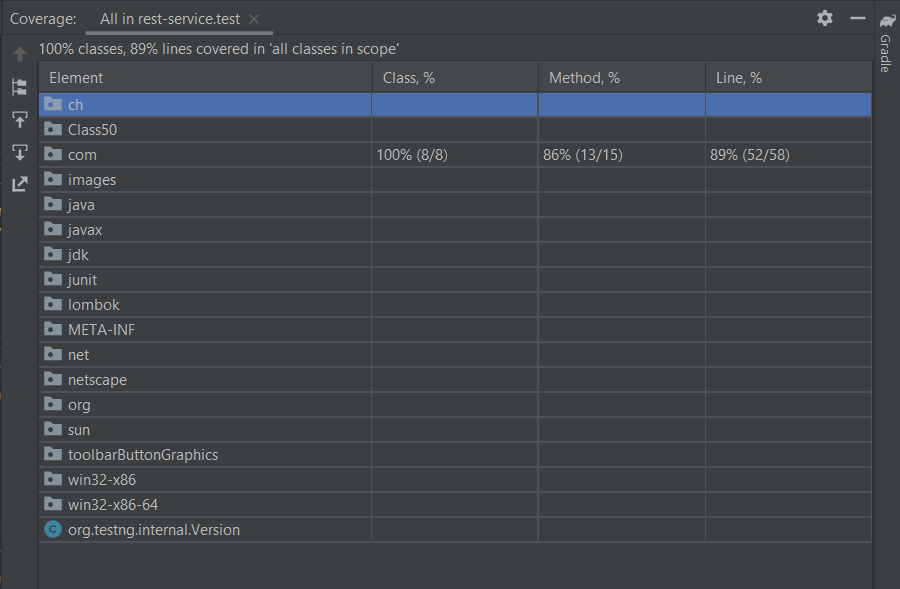

**Points to be considered for a new feature.** 

- We are maintaining one hashmap for identifying operations to be performed on input string. It will give us 
  the flexibility to add a new operations with minimal code changes in existing functionality.
- As of now we are just supporting _MD5_ algorithm for generating hash. In near future If we want to add a new 
  algorithm which is supported by java security then we just need to add the digit (by which this new algorithm
  would be identified) and algorithm implementation class in the operations' hashmap.This will reduce the failure
  chances of existing functionality.
- We can reuse the same code which is defined in _EncodeDecode_ class for supporting new hashing algorithms 
  (which are supported by java security).
- Below is the screenshot of the code coverage analysis.

  
  
